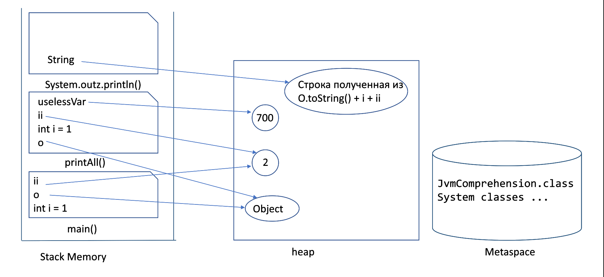
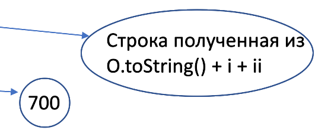

# Задача "Понимание JVM"

## ClassLoader'ы
Вначале JVM помощью ClassLoader загрузит классы. 
С помощью Application ClassLoader загрузит класс JvmComprehension.
С помощью Bootstrap ClassLoader загрузит классы System, Object и другие системные.

## Область памяти
При выполнении кода строк 1- 6 область памяти будет выглядеть следующем образом

После выполнения строки 6 из Stack Memory удалится фрейм System.out.println(), далее удалится фрейм printAll(), перейдет на строку 7. При этом в стеке создастся новый фрейм System.out.println(), куда передадим ссылку на строку "finished".

## Сборшик мусора

После завершения процедуры printAll(), сборщик мусора сможет почистить объекты представленные на картинке, т.к. данные объекты становятся недостижимыми

